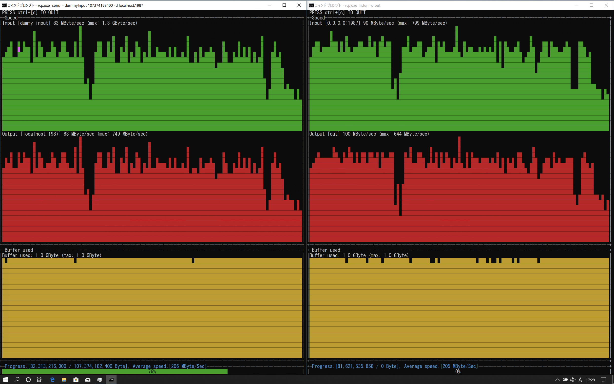

# rcp
remote copy



Overview
----

Commands for file transfer by tcp


Characteristic
----

- Transfer files using buffer between file read / write and transfer process
- Monitor read / write speed and transfer speed every second and display them in [Sparkline chart](https://images.app.goo.gl/f2adCQNKfWCG4ZJV8)
- Network and storage performance can be measured with dummy data transmission and dummy reception functions

download
-----------

[Release page] (https://github.com/masahide/rcp/releases) Select and download the one that matches your platform

How to use
---------

The main procedure is performed in the following two steps

- Listen to any port number on the receiving side
- Dial the destination port number on the sending side


Example of use
-----

### When listening on 1987 port on the receiving side (IP: 10.10.10.10) and sending

- Listen on TCP `1987` port on the receiving side

```bash
$ rcp listen -l: 1987 -o save_filename
```

- Send file to `10.10.10.10: 1987`

```bash
$ rcp send -d 10.10.10.10:1987 -i input_filename
```

### Dummy data transmission-> Discard received dummy data

- Receiver
```
$ rcp listen -l: 1987 --dummyOutput
```
- Sender
```bash
$ rcp send -d 10.10.10.10:1987 -i input_filename
```
